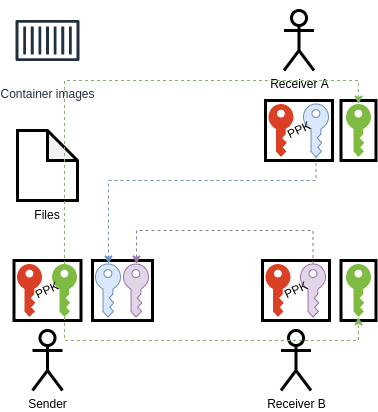
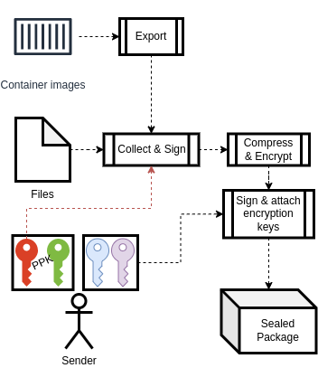
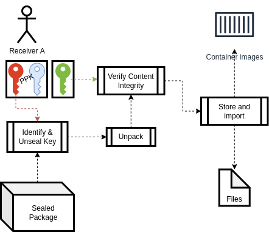

# Sealpack - sealed packaging for files and containers

This project allows the secure bundling of mobile code.
This means, files and container images can be packed like with any compression tool, but with a focus on the 
[CIA triad](https://www.f5.com/labs/learning-center/what-is-the-cia-triad).
In addition, it was designed for flexibility and extensibility, so it can be used in various contexts.

The approach consists of
* exporting container images in [OCI format](https://github.com/opencontainers/image-spec) to store them alongside files
* symmetric encryption for [fast and secure encryption](https://www.rfc-editor.org/rfc/rfc7539) of large files with a
* randomly generated [key sealed](https://www.oracle.com/java/technologies/jpl2-crypto.html) for specific recipients.

The resulting file can then be safely transmitted over insecure channels.

## Basic operation

In a very basic way, `sealpack` is a single-command CLI with the 3 actions `seal`, `inspect`, and `unseal`

The `seal` action
* Creates a compressed archive from files __and/or__  container images
* Cryptographically signs the contents
* Encrypts the archive with a randomly generated key
* Seals the key for specific receivers

The `inspect` action
* Checks if a file is a `sealpack` file
* Display size of compressed payload, used Hashing-Algorithm and number of potential receivers

The `unseal` action
* Verifies that a file is a `sealpack` file
* Checks if encryption key is included and unseals the key
* Decompresses the contents and verifies the contents to match the signature
* Decrypts the files into a target directory and images to a container registry or a local `containerd` instance

## High level overview
The prerequisite for a fully featured usage of `sealpack` is every entity having a private-public-key-pair (PPK).

> Private keys must never be shared, best is to [use TPM as PPK storage](https://blog.hansenpartnership.com/using-your-tpm-as-a-secure-key-store/).
> If not possible, use files with the least access permissions possible.

A mutual trust must be established by exchanging the public Keys. This means, the sender must have access to all public 
keys of potential receivers and each receiver must have access to the public key of the sender.



On the sender side, collection, packaging, signing, encryption, and sealing can then be performed in a single flow:



On the receiver side, unsealing, verification, unpacking and importing is also a single step:



## Build & Install

To build the CLI binary, just install the dependent modules and execute a `go build`:
```bash
go mod tidy
go build .
```

The `sealpack` binary now includes everything needed to be used. Consider moving it to a place at system's `PATH`.

## Usage
The 3 actions are subsequently described in detail.

### `seal`
```
Create a sealed package

Usage:
  sealpack seal [flags]

Flags:
  -c, --contents string            Provide all contents as a central configurations file
  -f, --file strings               Path to the files to be added
  -a, --hashing-algorithm string   Name of hashing algorithm to be used (default "SHA3_512")
  -h, --help                       help for seal
  -i, --image strings              Name of container images to be added
  -o, --output string              Filename to store the result in
  -p, --privkey string             Path to the private signing key. AWS KMS keys can be used with awskms:/// prefix
      --public                     Don't encrypt, contents are signed only and can be retrieved from any receiver
  -r, --recipient-pubkey strings   Paths of recipients' public keys
```

| Flag              | Short | Type   | Multiple | Mandatory | Default  | Description                                                                                                                       |
|-------------------|-------|--------|----------|-----------|----------|-----------------------------------------------------------------------------------------------------------------------------------|
| hashing-algorithm | a     | string | n        | n         | SHA3_512 | Name of algorithm to be used for signature hashing. Valid values must implement `crypto.Hash`.                                    |
| contents          | c     | string | n        | n         | -        | Provide all contents as a central configurations file in shallow (JSON format)[#json-format] instead of adding one-by-one.        |
| file              | f     | string | y        | n         | -        | Path to the files to be added to the package.                                                                                     |
| help              | h     | -      | -        | -         | -        | Flag to display help message. Exits instantly.                                                                                    |
| image             | i     | string | y        | n         | -        | Names of container images to be added. Full tag with registry can be provided, short forms will default to docker.io              |
| output            | o     | string | n        | y         | -        | Filename to store the resulting sealed file in.                                                                                   |
| privkey           | p     | string | n        | y         | -        | Path to the private signing key or AWS KMS keys can be used with awskms:/// prefix. PEM-based PKCS1, PKCS8 and EC keys are valid. |
| public            | -     | bool   | -        | n         | true     | Flag to not encrypt contents only sign files, so can be retrieved from any receiver.                                              |
| recipient-pubkey  | r     | string | y        | n         | -        | Paths of recipients' public keys. PEM-based PKIX and PKCS8 keys are valid.                                                        |

#### JSON format
The JSON format to define a list of contents, is kept very simple. The main object has 2 properties:
* `files`: array of strings, each entry defining one file
* `images`: array of objects, each one defining one container image defined by:
  * `registry`: hostname of the registry URL (optional; defaults to `docker.io`)
  * `name`: name of the image
  * `tag`: tag of the image
```json
{
  "files": [
    "secrets.yaml",
    "test.docx"
  ],
  "images": [
    {
      "registry": "cr.siemens.com",
      "name": "simatic/sample",
      "tag": "v0.0.1"
    },
    {
      "registry": "docker.io",
      "name": "alpine",
      "tag": "latest"
    }
  ]
}
```

### `inspect`
```
Inspects a sealed archive and allows for identifying any errors

Usage:
  sealpack inspect [File]

Flags:
  -h, --help   help for inspect
```

| Flag | Short | Description                                    |
|------|-------|------------------------------------------------|
| help | h     | Flag to display help message. Exits instantly. |

Inspecting a file leads to one of the following outputs:

Sealed File:
```
File is a sealed package.
        Payload size (compressed): 3368974 Bytes
        Singatures hashed using SHA-512 (64 Bit)
        Sealed for 2 Recievers
```

Unsealed File:
```
File is a public package.
        Payload size (compressed): 3369185 Bytes
        Singatures hashed using SHA-512 (64 Bit)
```

### `unseal`
```
Unpacks a sealed archive if the provided private key is valid

Usage:
  sealpack unseal [flags]

Flags:
  -a, --hashing-algorithm string   Name of hashing algorithm to be used (default "SHA3_512")
  -h, --help                       help for unseal
  -o, --output string              Output path to unpack the contents to (default "output")
  -p, --privkey string             Private key of the receiver
  -s, --signer-key string          Public key of the signing entity
  -r, --target-registry string     URL of the target registry to import container images; 'local' imports them locally (default "local")
```

| Flag              | Short | Type   | Multiple | Mandatory | Default  | Description                                                                                                           |
|-------------------|-------|--------|----------|-----------|----------|-----------------------------------------------------------------------------------------------------------------------|
| hashing-algorithm | a     | string | n        | n         | SHA3_512 | Name of algorithm to be used for signature hashing. Valid values must implement `crypto.Hash`.                        |
| help              | h     | -      | -        | -         | -        | Flag to display help message. Exits instantly.                                                                        |
| output            | o     | string | n        | y         | -        | Filename to store the resulting sealed file in.                                                                       |
| privkey           | p     | string | n        | n         | -        | Path to the private signing key or AWS KMS keys can be used with awskms:/// prefix. PEM-based PKCS1, PKCS8 are valid. |
| signer-key        | s     | string | n        | y         | -        | Public key of the signing entity.                                                                                     |
| target-registry   | r     | string | n        | n         | local    | PURL of the target registry to import container images; 'local' imports them locally.                                 |
